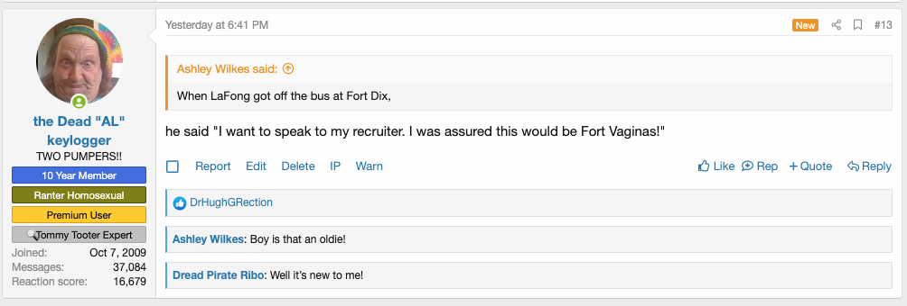

# Xen Rep

This plugin is based off the original reputation functionality that existed for years on my message board [AMB](https://www.anothermessageboard.com). 

AMB ran vBulletin 3.x for several years which had a feature that allowed users to rate posts and leave a comment with their rating. Originally these comments were only viewable to the person who made the post, however some time around 2006 I installed an addon that displayed the comments directly in the post. This functionality became quite popular on AMB was known as "rep". 

In early 2019 I switched AMB over to Xenforo and the rep functionality was lost. This addon recaptures the essence of the AMB rep functionality.

# Links that Helped

This is my first Xenforo addon. Previously I had written multiple addon for vBulletin 3.x, but this is the first addon I've written for any message board software in a few years.

Along this journey of learning I thought it might be helpful to keep track of some of the links I found useful when searching for foundmental information required for just about any Xenforo addon.

### Displaying a View 

* https://xenforo.com/community/threads/creating-an-alert.133737/

### Getting Alerts to Work

* https://xenforo.com/community/threads/creating-an-alert.133737/
* https://xenforo.com/community/threads/sending-alerts-from-addon.177579/
* https://xenforo.com/community/threads/content-type-management.116571/#post-1070231
* https://github.com/luutruong/GroupWall

### "Could not determine content viewability"

* https://xenforo.com/community/threads/tips-on-extending-the-approval-queue-handler.138568/

### Printing out debugging messages

* https://xenforo.com/xf2-docs/dev/development-tools/
